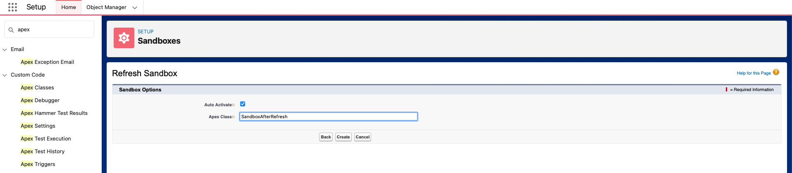

# Post Copy Sandbox / Sandbox Refresh Script

Simple script to run during Sandbox refresh to obfuscate Contact emails and reset specified User email addresses.

# Prerequisites

In order to use this code as configured, you'll need to create a new Public Group called "Sandbox Users". Users that are a part of this Group will have their email addresses updated post-refresh.

# How to run

From Setup > Sandboxes, select the Sandbox you want to refresh. When you get to the screen below, enter `SandboxAfterRefresh` in the Apex Class field and click "Create".

